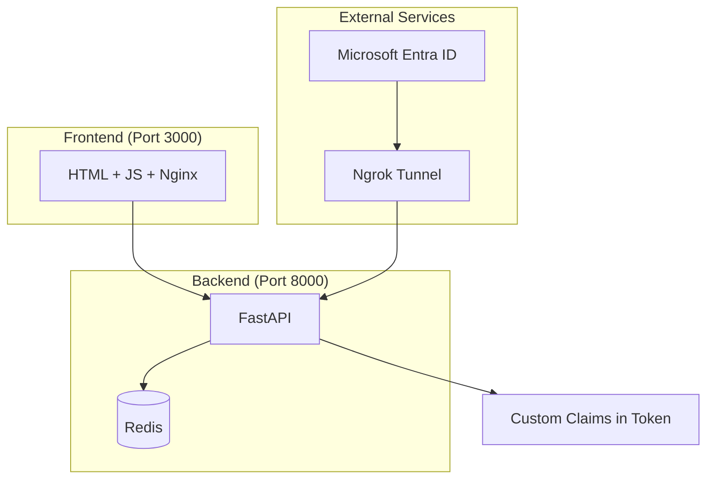

# 🔐 Custom Claims Provider for Microsoft Entra ID

A complete solution for injecting custom frontend data into Microsoft Entra ID tokens using a **Custom Claims Provider**. Built with **FastAPI**, **Docker**, and **Nginx** for easy deployment and development.

## 🌟 Features

- ✅ **Custom Claims Injection**: Add frontend data directly to Entra ID tokens
- ✅ **Separated Architecture**: Clean separation between frontend and backend
- ✅ **Docker Orchestration**: Easy deployment with docker-compose
- ✅ **FastAPI + Redis**: Robust backend with temporary data storage
- ✅ **Nginx Frontend**: Static file serving and API proxying
- ✅ **Ngrok Integration**: Automatic public exposure for Entra callbacks
- ✅ **Hot Reload Development**: Real-time code changes during development

## 🏗️ Architecture



## 📁 Project Structure

```
CUSTOM-CLAIMS-PROVIDER/
├── 📁 Custom-Claims-Back-end/     # Backend Services
│   ├── 📄 main.py                # FastAPI application
│   ├── 📄 requirements.txt       # Python dependencies
│   ├── 🐳 Dockerfile             # Backend container
│   └── 📁 logs/                  # Application logs
│
├── 📁 Custom-Claims-Front-end/    # Frontend Services  
│   ├── 📄 test.html              # Web application
│   ├── 📄 frontend-integration.js # JavaScript library
│   ├── ⚙️ nginx.conf             # Nginx configuration
│   └── 📁 static/                # Static assets
│
├── 🐳 docker-compose.yml          # Services orchestration
├── 🔧 .env                        # Environment variables
├── 📋 .dockerignore               # Docker ignore rules
├── 🚀 setup.sh                    # Automated setup
└── 📖 README.md                   # This documentation
```

## 🚀 Quick Start

### Prerequisites

- **Docker** and **Docker Compose** installed
- **Free Ngrok account**: https://ngrok.com
- **Microsoft Entra ID application** registered

### 1. Clone and Setup

```bash
# Navigate to your project directory
cd CUSTOM-CLAIMS-PROVIDER/

# Make setup script executable
chmod +x setup.sh

# Run automated setup
./setup.sh
```

### 2. Configure Environment

Edit `.env` file with your credentials:

```bash
# Required: Your Azure application credentials
AZURE_CLIENT_ID=your-actual-client-id
AZURE_TENANT_ID=b8e62cd3-6661-4faa-91f3-ffe016db96e8

# Required: Get free token from ngrok.com
NGROK_AUTHTOKEN=your-ngrok-token
```

### 3. Start Services

```bash
# Start all services
docker-compose up -d

# Check service status
docker-compose ps

# View logs
docker-compose logs -f
```

## 🌐 Service Endpoints

| Service | URL | Description |
|---------|-----|-------------|
| **Frontend App** | http://localhost:3000 | Main web application |
| **Backend API** | http://localhost:8000 | FastAPI backend |
| **API Docs** | http://localhost:8000/docs | Swagger documentation |
| **Health Check** | http://localhost:8000/health | Service health status |
| **Ngrok Dashboard** | http://localhost:4040 | Public tunnel status |
| **Redis** | localhost:6379 | Data storage (internal) |

## ⚙️ Microsoft Entra Configuration

### 1. Register Custom Authentication Extension

1. **Azure Portal** → **Microsoft Entra ID** → **Enterprise applications**
2. **Custom authentication extensions** → **Create a custom extension**
3. Configure:
   - **Event type**: `TokenIssuanceStart`
   - **Target URL**: Your ngrok URL (e.g., `https://abc123.ngrok.io/api/custom-claims`)
   - **API Authentication**: Create new app registration
   - **Claims**: Add `businessUnit`, `deviceInfo`, `customData`, `apiVersion`

### 2. Configure Your Application

1. Go to your application in **Enterprise applications**
2. **Single sign-on** → **Attributes & Claims** → **Edit**
3. **Advanced settings** → **Custom claims provider** → **Configure**
4. Select your Custom Claims Provider
5. **Map claims**:
   - `businessUnit` → `customClaimsProvider.businessUnit`
   - `deviceInfo` → `customClaimsProvider.deviceInfo`
   - `customData` → `customClaimsProvider.customData`

## 🧪 Testing the Flow

### 1. Open Application
```bash
open http://localhost:3000
```

### 2. Complete Test Flow

1. **Test Connection** → Verify backend API connectivity
2. **Fill Form**:
   - Enter your Entra email
   - Select business unit
   - Add custom data
3. **Start Authentication** → Redirects to Microsoft Entra
4. **Login** → Use your Entra credentials
5. **View Results** → See custom claims in the returned token

### 3. Debug and Monitor

```bash
# View backend logs in real-time
docker-compose logs -f custom-claims-api

# Check stored data
curl http://localhost:8000/debug/stored-data

# Monitor all services
docker-compose logs -f
```

## 🛠️ Development

### Hot Reload Enabled

Files are mounted for real-time development:

```bash
# Backend changes auto-reload
# Edit Custom-Claims-Back-end/main.py

# Frontend changes require browser refresh
# Edit Custom-Claims-Front-end/test.html
```

### Data Flow

**1. Frontend → Backend:**
```json
{
  "user_id": "user@example.com",
  "business_unit": "Engineering",
  "device_info": "Chrome-Windows",
  "custom_data": "Additional info"
}
```

**2. Backend → Entra:**
```json
{
  "data": {
    "actions": [{
      "claims": {
        "businessUnit": "Engineering",
        "deviceInfo": "Chrome-Windows",
        "customData": "Additional info",
        "apiVersion": "1.0.0",
        "source": "custom-claims-provider"
      }
    }]
  }
}
```

## 🔧 Management Commands

### Service Management
```bash
# Start all services
docker-compose up -d

# Stop all services
docker-compose down

# Restart specific service
docker-compose restart custom-claims-api
docker-compose restart frontend

# Rebuild images
docker-compose build --no-cache
```

### Debugging
```bash
# View logs for specific service
docker-compose logs custom-claims-api
docker-compose logs frontend
docker-compose logs ngrok
docker-compose logs redis

# Access Redis CLI
docker-compose exec redis redis-cli

# Check service health
curl http://localhost:8000/health
curl http://localhost:3000
```

### Data Management
```bash
# View stored frontend data
curl http://localhost:8000/debug/stored-data

# Clear Redis data
docker-compose exec redis redis-cli FLUSHALL
```

## 🚨 Troubleshooting

### Common Issues

**1. Services won't start:**
```bash
# Check Docker daemon
docker ps

# View detailed logs
docker-compose logs
```

**2. Ngrok connection failed:**
```bash
# Check ngrok token in .env
docker-compose logs ngrok

# Restart ngrok service
docker-compose restart ngrok
```

**3. API not responding:**
```bash
# Check backend logs
docker-compose logs custom-claims-api

# Verify Redis connection
docker-compose exec redis redis-cli ping
```

**4. Custom claims not appearing:**
```bash
# Verify Entra configuration
# Check ngrok URL is correct in Azure
# Monitor backend during authentication
docker-compose logs -f custom-claims-api
```

**5. CORS errors:**
```bash
# Restart frontend service
docker-compose restart frontend

# Check nginx configuration
docker-compose exec frontend cat /etc/nginx/nginx.conf
```

## 🔒 Security Considerations

### Development vs Production

**Development (Current):**
- CORS allows all origins (`*`)
- Debug endpoints enabled
- Detailed error messages
- No JWT token validation

**Production Checklist:**
- [ ] Configure specific CORS origins
- [ ] Disable debug endpoints
- [ ] Implement JWT token validation
- [ ] Use HTTPS everywhere
- [ ] Secure Redis with authentication
- [ ] Replace ngrok with proper domain
- [ ] Add rate limiting
- [ ] Implement audit logging

### Environment Variables

```bash
# Never commit these values to git
AZURE_CLIENT_ID=sensitive-value
NGROK_AUTHTOKEN=sensitive-value
SECRET_KEY=sensitive-value
```

## 📚 References

- [Microsoft Entra Custom Claims Provider](https://learn.microsoft.com/en-us/entra/identity-platform/custom-claims-provider-overview)
- [FastAPI Documentation](https://fastapi.tiangolo.com/)
- [Docker Compose Guide](https://docs.docker.com/compose/)
- [Ngrok Documentation](https://ngrok.com/docs)
